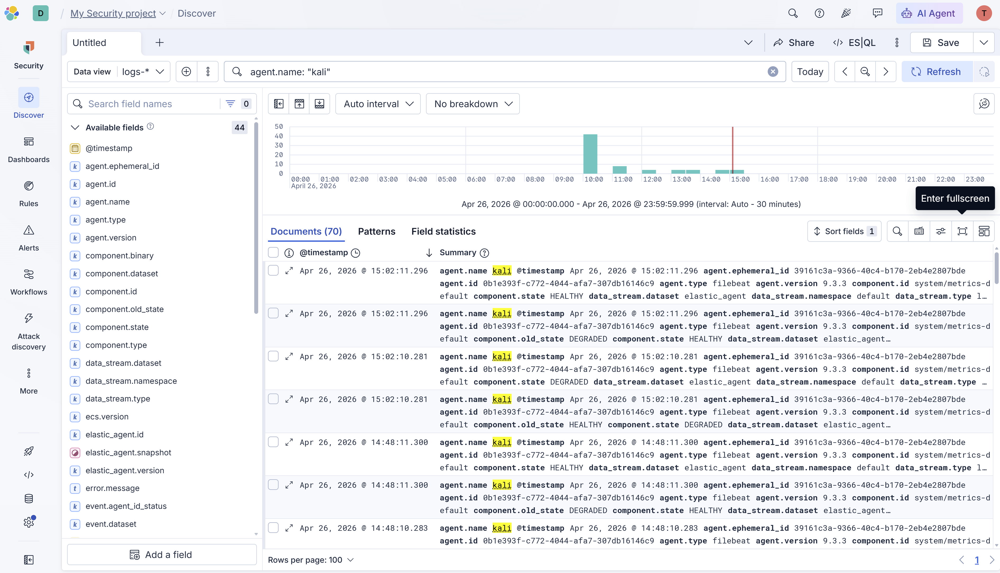
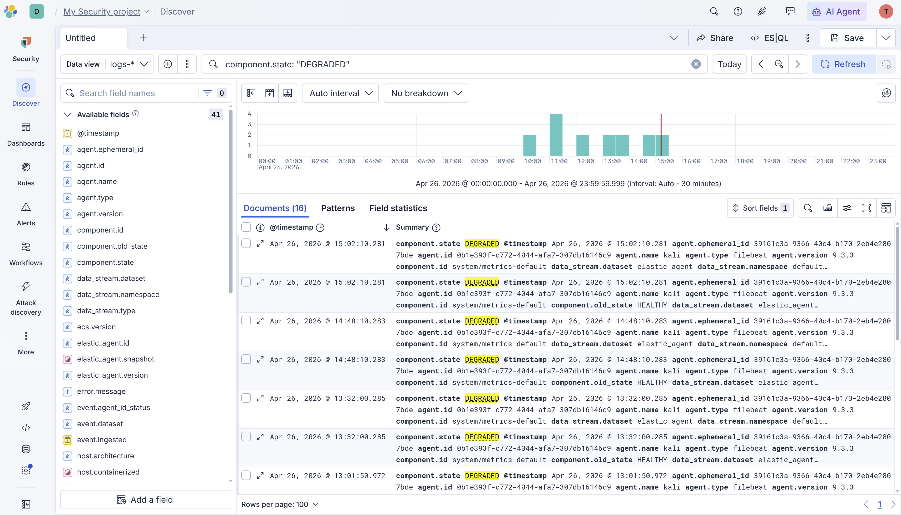
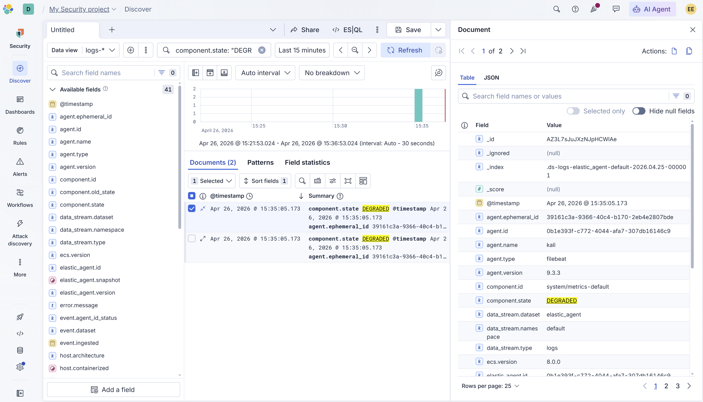

# SOC Lab 14 — Threat Hunting in Kibana

## Table of Contents
1. [Executive Summary](#executive-summary)
2. [Incident Ticket (ServiceNow Simulation)](#incident-ticket-servicenow-simulation)
3. [Lab Objectives](#lab-objectives)
4. [Environment Overview](#environment-overview)
5. [Threat Hunting Workflow](#threat-hunting-workflow)
6. [Hunt Findings](#hunt-findings)
7. [Detection Engineering Insights](#detection-engineering-insights)
8. [Evidence](#evidence)
9. [Conclusions](#conclusions)
10. [Next Steps](#next-steps)

---

## Executive Summary

This lab documents threat hunting activities performed in Kibana Discover against logs ingested from the Kali Linux host via the Elastic Agent.

Threat hunting is a proactive security practice where analysts search through logs and telemetry data to identify suspicious activity that automated detection rules may have missed. Unlike alert-driven investigation, threat hunting begins with a hypothesis and uses query-based analysis to surface anomalous behavior across the environment.

In this lab, KQL queries were used in Kibana Discover to hunt for suspicious activity on the Kali Linux host. Analysts identified 70 documents associated with the Kali agent and isolated 16 events showing DEGRADED component states — indicative of agent instability or potential interference with the monitoring stack. Event-level analysis was performed to extract field-level detail relevant to the investigation.

---

## Incident Ticket (ServiceNow Simulation)

**Incident ID:** INC-0014
**Date/Time Detected:** 2026-04-26 13:01
**Detected By:** SOC Analyst (Lab Simulation)
**Severity:** Low
**Category:** Threat Hunting
**Subcategory:** Anomalous Host Behavior / Agent State Analysis

---

### Short Description
Proactive threat hunting performed in Kibana Discover against Kali Linux host logs. DEGRADED component state events identified and analyzed at the field level.

---

### Detailed Description
Threat hunting was conducted in Kibana Discover using the `logs-*` data view to query telemetry collected by the Elastic Agent from the Kali Linux host. Initial scoping identified 70 documents associated with the Kali agent across the hunting period.

A targeted query for DEGRADED component states returned 16 events indicating periods where the Elastic Agent's system metrics component transitioned from a HEALTHY to a DEGRADED state. Event-level analysis of individual documents revealed detailed field metadata including agent identifiers, timestamps, data stream context, and component state transitions.

---

### Indicators of Compromise (IOCs)
- Host: kali
- Agent ID: 0b1e393f-c772-4044-afa7-307db16146c9
- Component: system/metrics-default
- Anomalous state: DEGRADED
- State transitions: HEALTHY → DEGRADED observed across multiple timestamps

---

### Analysis
The DEGRADED component state events indicate that the Elastic Agent's system metrics collection component experienced instability during the hunting period. This pattern can be observed in environments where:

- System resources are under stress
- Agent processes are interrupted or restarted
- Configuration changes affect component behavior
- Malicious activity interferes with monitoring processes

In this lab environment, the state transitions are consistent with the attack simulation activity performed in Lab 13, where repeated SSH brute force attempts and credential access commands may have introduced system resource pressure.

---

### Impact Assessment
- No confirmed malicious activity identified through threat hunting
- DEGRADED state events represent potential monitoring blind spots
- Agent state transitions warrant continued monitoring
- Threat hunting confirmed data pipeline is operational for Kali host telemetry

---

### Response Actions Taken
- Opened Kibana Discover with `logs-*` data view
- Queried all Kali agent logs using `agent.name: "kali"`
- Identified 70 documents across the hunting period
- Queried for DEGRADED component states using `component.state: "DEGRADED"`
- Isolated 16 anomalous state events
- Performed field-level analysis on individual event documents
- Documented findings and hunting methodology

---

### Recommended Actions
- Monitor for sustained DEGRADED state events as potential indicator of interference
- Correlate component state transitions with system activity timelines
- Implement alerting for repeated HEALTHY to DEGRADED state transitions
- Continue expanding log coverage to include SSH authentication events

---

### Status
Closed (No Threat Confirmed — Continued Monitoring Recommended)

---

## Lab Objectives

- Perform proactive threat hunting in Kibana Discover
- Use KQL queries to scope and filter host telemetry
- Identify anomalous component state events on the Kali Linux host
- Perform field-level analysis on individual log documents
- Document threat hunting methodology and findings

---

## Environment Overview

**Operating System:** Kali Linux (Virtual Machine)

**Tools Used**
- Elastic Security (Cloud Serverless)
- Kibana Discover
- KQL (Kibana Query Language)
- Elastic Agent v9.3.3

**Data View:** logs-*

**Hunting Period:** April 26, 2026

---

## Threat Hunting Workflow

### 1. Open Kibana Discover

Kibana Discover was accessed via the Elastic Security left navigation. The data view was set to `logs-*` to query all ingested log data.

---

### 2. Scope the Hunt — Query Kali Host Logs

An initial scoping query was run to identify all telemetry associated with the Kali Linux host.

**Query:**

**Result:** 70 documents returned across the hunting period, confirming active log ingestion from the Kali agent.

---

### 3. Hypothesis — Investigate Component State Anomalies

Based on the initial scoping results, a hypothesis was formed: component state transitions from HEALTHY to DEGRADED may indicate system instability or monitoring interference related to the attack simulation performed in Lab 13.

**Query:**

**Result:** 16 documents returned showing DEGRADED component state events on the Kali host.

---

### 4. Field-Level Analysis

Individual DEGRADED state events were expanded in Kibana Discover to extract field-level detail. Key fields analyzed included:

- `agent.name` — Confirmed Kali host
- `agent.id` — Unique agent identifier
- `component.id` — system/metrics-default
- `component.state` — DEGRADED
- `component.old_state` — HEALTHY
- `data_stream.dataset` — elastic_agent
- `@timestamp` — Event timing

---

## Hunt Findings

### Finding 1 — Kali Host Telemetry Confirmed

70 documents were identified from the Kali Linux host confirming the Elastic Agent is actively ingesting system telemetry. The data includes agent health metrics, component state events, and data stream metadata.

### Finding 2 — DEGRADED Component State Events

16 events were identified where the system metrics component transitioned to a DEGRADED state. These events were distributed across the hunting period and correlate with periods of increased system activity.

| Field | Value |
|-------|-------|
| Host | kali |
| Component | system/metrics-default |
| State | DEGRADED |
| Previous State | HEALTHY |
| Event Count | 16 |

### Finding 3 — Detection Gap Confirmed

SSH authentication failure events were not present in the `logs-*` data stream, confirming the detection gap identified in Lab 13. The SSH logs remain in the Kali systemd journal and are not being forwarded to Elastic.

---

## Detection Engineering Insights

- Threat hunting begins with a hypothesis — not an alert. Analysts must proactively define what they are looking for before querying
- KQL provides powerful field-level filtering that enables analysts to scope hunts efficiently from broad to specific
- Component state transitions in monitoring agents can indicate both system instability and potential tampering with security tooling
- The absence of expected data (SSH auth logs) is itself a finding — analysts must hunt for detection gaps as well as threats
- Field-level document analysis is a core skill for extracting actionable intelligence from raw log data
- Threat hunting results should always be documented regardless of whether a confirmed threat is identified — negative results validate detection coverage

---

## Evidence

All screenshots are stored in the repository and demonstrate Kibana Discover threat hunting queries and field-level event analysis.

---

## Conclusions

This lab successfully demonstrated proactive threat hunting methodology using Kibana Discover. KQL queries were used to scope host telemetry, identify anomalous component state events, and perform field-level analysis on individual log documents.

The identification of 16 DEGRADED component state events provides a concrete hunting finding that warrants continued monitoring. The confirmation of the SSH detection gap reinforces the remediation actions identified in Lab 13 and demonstrates the analyst's ability to identify and document coverage blind spots.

This lab completes the Elastic SIEM phase of the portfolio, transitioning from infrastructure setup through log ingestion, detection rule configuration, attack simulation, and proactive threat hunting.

---

## Next Steps

- Lab 15: GRC — Log Retention Policy (NIST SP 800-53 Mapping)
- Begin the GRC phase of the portfolio
- Map technical SOC work to compliance frameworks
- Build evidence-based GRC labs tied to real detections
- Transition narrative: Traffic → Logs → Detection → SIEM → Risk → Compliance
